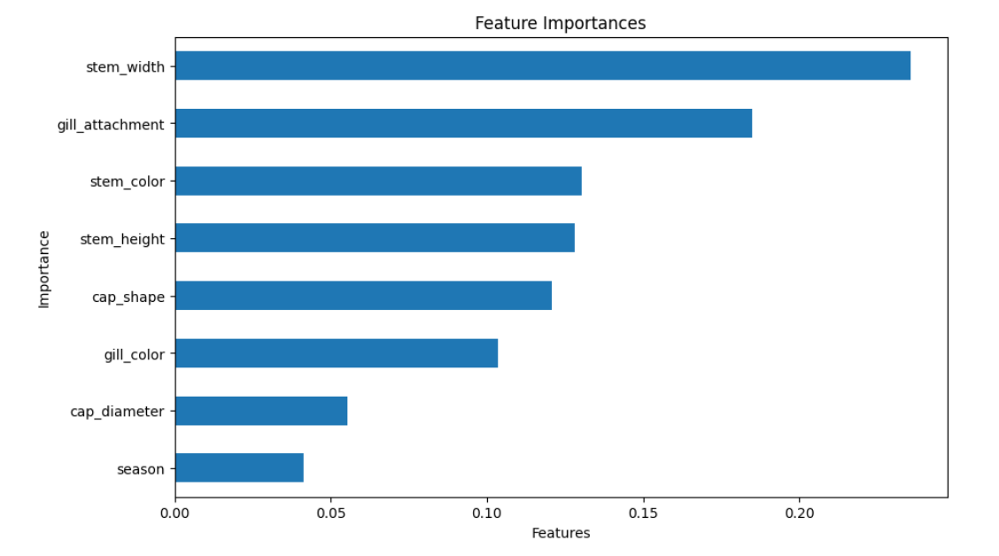

# Mushroom Edibility Classifier 🍄

## 📌 Project Overview
This project focuses on a binary classification problem: predicting whether a mushroom is **Edible (0)** or **Poisonous (1)** based on its physical features. 

Using a dataset of mushroom characteristics, I implemented and evaluated three different machine learning models, progressing from basic algorithms to more complex ensemble methods. The project culminates in a tuned Gradient Boosting model and an analysis of the most significant features affecting edibility.

## 📂 Dataset
The dataset contains **54,035 instances** with 9 features.
* **Source:** [Prisha Sawhney on Kaggle](https://www.kaggle.com/datasets/prishasawhney/mushroom-dataset/data)
* **Target Variable:** `class` (0 = Edible, 1 = Poisonous)
* **Features:** Cap diameter, cap shape, gill attachment, gill color, stem height, stem width, stem color, and season.

## 🛠️ Workflow
1.  **Data Exploration:** Checked data structure and grouped statistics by target class.
2.  **EDA (Exploratory Data Analysis):** Visualized feature distributions (Cap Diameter, Stem Height, Stem Width) using box plots to identify trends between classes.
3.  **Model Training:**
    * **Logistic Regression:** Used as a baseline model.
    * **Decision Tree Classifier:** Implemented to capture non-linear relationships.
    * **Gradient Boosting Classifier:** Implemented for robust performance.
4.  **Hyperparameter Tuning:** Adjusted parameters (learning rate, max depth, estimators) of the Gradient Boosting model to optimize performance.
5.  **Feature Importance:** Analyzed which mushroom attributes contributed most to the predictions.

## 📊 Model Results

| Model | Accuracy | Summary |
| :--- | :--- | :--- |
| **Logistic Regression** | 62% | Basic baseline performance. |
| **Decision Tree** | **98%** | Excellent performance, capturing complex splits. |
| **Gradient Boosting (Default)**| 88% | Strong baseline ensemble performance. |
| **Gradient Boosting (Tuned)** | 90% | Improved precision and recall after parameter tuning. |

## 🔑 Key Findings
* **Stem Width** and **Stem Height** proved to be significant indicators of a mushroom's class.
* While Decision Trees achieved the highest raw accuracy, Gradient Boosting provided a robust alternative with high generalizability.
* Hyperparameter tuning successfully improved
